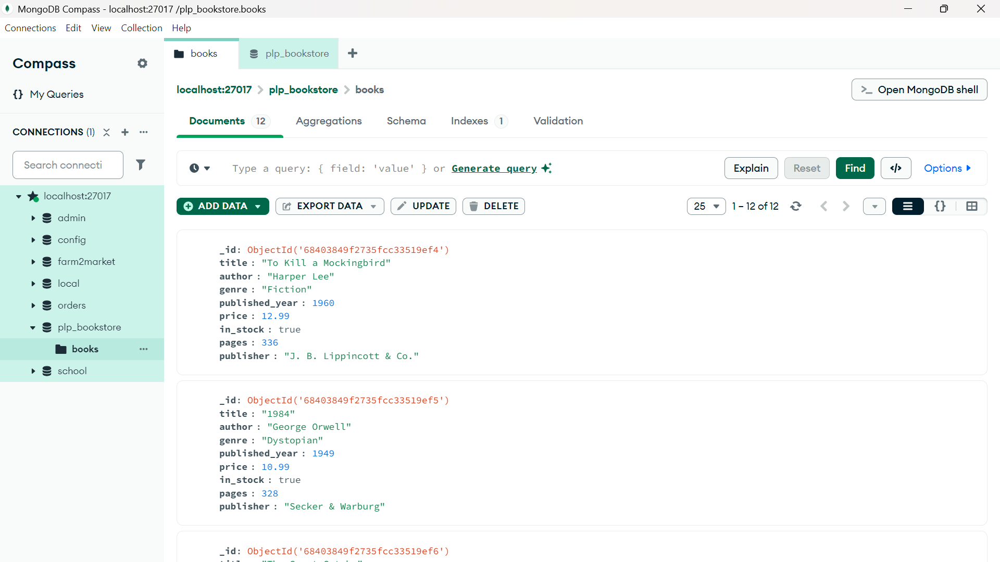

# 📚 PLP Bookstore – MongoDB Fundamentals Assignment

## 🛠️ How to Run

### Requirements

- Node.js and npm
- MongoDB installed locally OR MongoDB Atlas account

### Step-by-Step

1. **Clone your repository**

```bash
git clone <your-github-repo-url>
cd <repo-folder>
```

2. **Install MongoDB Node.js Driver (if not already installed)**

```bash
npm install mongodb
```

3. **Run the insert script**

```bash
node insert_books.js
```

4. **Open MongoDB Compass or mongosh**

   - Connect to `mongodb://localhost:27017`
   - Use the database: `plp_bookstore`
   - Explore the collection: `books`

5. **Run queries**

- Open `queries.js`
- Copy/paste individual queries into MongoDB Compass (or `mongosh` terminal)

## 📸 Screenshot


